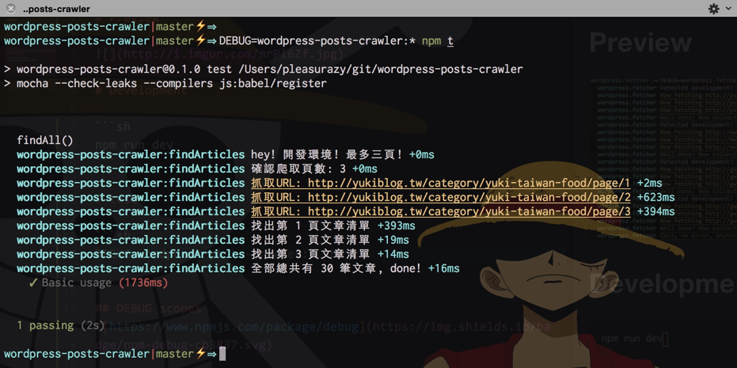

# Preview



## Install

```sh
npm install wordpress-posts-crawler --save-dev
```

## Usage

> findAll({ url: String })

```js
import wordpress from 'wordpress-posts-crawler'

wordpress
  .findAll({ url: 'http://path/to/wordpress/category/list/' })
  .then((result) => {
    // expect array
    console.log(result)

    console.log(result[0])
    // {
    //  title: String
    //  url: String<Url>
    //  datetime: String<ISO8601>
    // }
  })
```

> find({ url: String })

```js
import wordpress from 'wordpress-posts-crawler'

wordpress
  .find({ url: 'http://path/to/wordpress/post/id' })
  .then((result) => {

    console.log(result)
    // {
    //  address: Array<String>
    //  body: String<HTMLString>
    //  cover: String<Url>
    //  datetime: String<ISO8601>
    //  images: Array<String<Url>>
    //  title: String
    //  url: String<Url>
    // }
  })
```

## Development

```sh
npm run dev
```

## ENV

```sh
NODE_ENV=development # default
NODE_ENV=production
```

## test

```sh
DEBUG=wordpress-posts-crawler:* npm t
```

## DEBUG scopes 

- `wordpress-posts-crawler:*`
- `wordpress-posts-crawler:find`
- `wordpress-posts-crawler:findAll`
